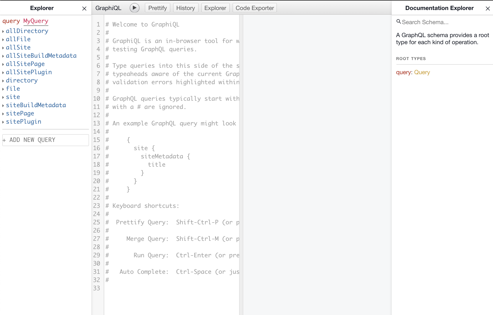
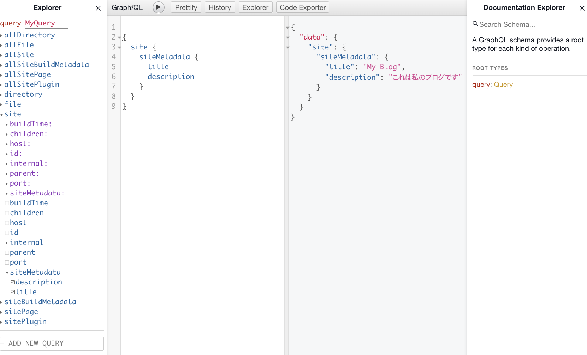

<p align="center">
  <a href="https://www.gatsbyjs.org">
    
  </a>
</p>
<h1 align="center">
  Gatsbyの hello-world スターターを使用しています！
</h1>


## 🚀 クイックスタート

1.  **Gastbyのサイトを作成する**

    Gatsby CLI(コマンドラインツール)を使って、hello-worldスターターを指定して新しいサイトを作成します。

    ```shell
    # hello-worldスターターを使用して新しいGatsbyサイトを作成する
    gatsby new my-hello-world-starter https://github.com/gatsbyjs/gatsby-starter-hello-world
    ```

2.  **開発を始めよう！**

    新しく作ったサイトのディレクトリに移動して起動する。

    ```shell
    cd my-hello-world-starter/
    gatsby develop
    ```

3.  **ソースコードを開いて編集を始めましょう！！**

    ブラウザで `http://localhost:8000` にアクセスするとあなたのサイトは実行されています！

    _Note: 2番めのリンク: _`http://localhost:8000/___graphql`_も表示されています。 これは、データのクエリを試すために使うツールです。 このツールの使い方は、[Gatsby tutorial](https://www.gatsbyjs.org/tutorial/part-five/#introducing-graphiql)を見てください！_

    `my-hello-world-starter` ディレクトリを好きなコードエディタで開き、`src/pages/index.js` を編集します。変更して保存するとブラウザでそれがリアルタイムで反映されます！

## 🧐 ディレクトリの中身は？

Gatsbyプロジェクトの中のトップレベルのファイルとディレクトリを簡単に確認しましょう。

    .
    ├── node_modules
    ├── src
    ├── .gitignore
    ├── .prettierrc
    ├── gatsby-browser.js
    ├── gatsby-config.js
    ├── gatsby-node.js
    ├── gatsby-ssr.js
    ├── LICENSE
    ├── package-lock.json
    ├── package.json
    └── README.md

1.  **`/node_modules`**: このディレクトリには、プロジェクトが依存するすべてのコードモジュール（npmパッケージ）が自動的にインストールされます。

2.  **`/src`**: このディレクトリには、サイトのヘッダーやページテンプレートなど、サイトのフロントエンドに表示されるもの（ブラウザーに表示されるもの）に関連するすべてのコードが含まれます。`src`「ソースコード」の規約です。

3.  **`.gitignore`**: このファイルは、バージョン履歴を追跡/保持しないファイルをgitに指示します。

4.  **`.prettierrc`**: これは[Prettier](https://prettier.io/)の構成ファイルです。Prettierは、コードのフォーマットの一貫性を保つのに役立つツールです。

5.  **`gatsby-browser.js`**: This file is where Gatsby expects to find any usage of the [Gatsby browser APIs](https://www.gatsbyjs.org/docs/browser-apis/) (if any). These allow customization/extension of default Gatsby settings affecting the browser.

6.  **`gatsby-config.js`**: これは、Gatsbyサイトのメイン構成ファイルです。ここでは、サイトのタイトルや説明、含めるGatsbyプラグインなど、サイトに関する情報（メタデータ）を指定できます (詳細については[config docs](https://www.gatsbyjs.org/docs/gatsby-config/)を確認してください)。

7.  **`gatsby-node.js`**: このファイルは、Gatsbyが[Gatsby Node API](https://www.gatsbyjs.org/docs/node-apis/)（存在する場合）の使用法を見つけることを期待する場所です。これらにより、サイト構築プロセスの一部に影響を与えるデフォルトのギャツビー設定のカスタマイズ/拡張が可能になります。

8.  **`gatsby-ssr.js`**: このファイルは、Gatsbyが[Gatsbyサーバー側レンダリングAPI](https://www.gatsbyjs.org/docs/ssr-apis/)（存在する場合）の使用状況を見つけることを期待する場所です。これらにより、サーバー側のレンダリングに影響を与えるデフォルトのギャツビー設定をカスタマイズできます。

9.  **`LICENSE`**: GatsbyはMITライセンスに基づいてライセンスされています。

10. **`package-lock.json`** (See `package.json` below, first). これは、プロジェクトにインストールされたnpm依存関係の正確なバージョンに基づいて自動的に生成されたファイルです。**（このファイルを直接変更することはありません）。**

11. **`package.json`**: Node.jsプロジェクトのマニフェストファイル。メタデータ（プロジェクトの名前、作成者など）などが含まれます。このマニフェストは、npmがプロジェクトにインストールするパッケージを認識する方法です。

12. **`README.md`**: プロジェクトに関する有用な参照情報を含むテキストファイル。

## 🎓 Gastbyについて学ぼう！

もっとガイダンスを探していますか？Gatsbyの完全なドキュメントは [ website](https://www.gatsbyjs.org/)にあります。

## 💫 デプロイ

[](https://app.netlify.com/start/deploy?repository=https://github.com/gatsbyjs/gatsby-starter-hello-world)

[](https://zeit.co/import/project?template=https://github.com/gatsbyjs/gatsby-starter-hello-world)

-----------

# Gastbyを使ってReactとMarkdownでブログを作成する

[このチュートリアル](https://www.gatsbyjs.org/docs/ssr-apis/)と[このチュートリアル](https://www.gatsbyjs.org/blog/2017-07-19-creating-a-blog-with-gatsby/)をやっていく！！


## インストール

1.  **クイックスタートを参考にGatsbyをインストールする**

    Gatsby CLI(コマンドラインツール)を使って、hello-worldスターターを指定して新しいサイトを作成します。

    ```shell
    # hello-worldスターターを使用して新しいGatsbyサイトを作成する
    gatsby new my-blog https://github.com/gatsbyjs/gatsby-starter-hello-world
    ```

2.  **GatsbyでMarkdownを変換するプラグインをインストールする**

    MarkdownをGatsbyサイトのコンテンツソースとして使うには、2つのプラグインをインストールする必要があります: `gatsby-source-filesystem`と`gatsby-transformer-remark`
    これらはGatsbyと同様に`npm`コマンドを使ってインストールできます

    ```shell
    # npm のiオプションはinstallの省略形
    # npm5.0.0以降だと--saveをつけなくてもpackage.jsonのdependenciesに追加してくれるらしい
    npm i gatsby-source-filesystem gatsby-transformer-remark
    ```

    `gatsby-source-filesystem`プラグインはお使いのコンピュータからファイルを読み込むのに使います。`gatsby-transformer-remark`プラグインはGraphQLでMarkdownファイルの内容を利用できるようになります。

    変換の流れは、
      1. ディレクトリから`gastby-source-filesystem`がMarkdownとして読み込む
      2. 読み込んだ1を`gatsby-transfomer-remark`がHTMLに変換する
    

    インストールが終わったら、`gatsby-config.js`を編集します。

    ```js
    module.exports = {
      siteMetadata: {
        title: 'My Blog',
        description: 'これは私のブログです',
      },
      plugins: [
        {
          resolve: `gatsby-source-filesystem`,
          options: {
            name: `pages`,
            path: `${__dirname}/src/pages`,
          },
        },
        {
          resolve: `gatsby-transformer-remark`,
          options: {
            plugins: [],
          },
        },
      ],
    }
    ```

    `options`オブジェクトを使うとプラグインにデータを渡すことができます。オプションが無いときは、`"plugin-name"`でいける。

3.  **最初のMarkdownブログ投稿を作る**
    `gatsby-source-filesystem`は`src/pages`内にコンテンツがあると思ってるので、その中にMarkdownファイルを入れます。

    Gatsbyにはフォルダ名に命名規則があるわけではないですが、ここでは典型的なフォルダ名をつけようと思います。例えば、`MM-DD-YYYY-title`のように`03-26-2020-helloworld`といった感じで。

    ```shell
    $ mkdir 2020-03-21-first-post
    $ mkdir 2020-03-23-second-post
    $ mkdir 2020-03-25-third-post
    $ touch 2020-03-21-first-post/index.md
    $ touch 2020-03-23-second-post/index.md
    $ touch 2020-03-25-third-post/index.md
    ```

    作成したMarkdownを編集します。`2020-03-21-first-post/index.md`は以下のようになります。

    ```markdown
    ---
    path: '/first-post'
    date: '2020-03-21'
    title: 'My first Post'
    tags: ['foo', 'bar']
    excerpt: ''
    ---

    Lorem ipsum.
    ```

    `---`で囲まれたブロックは[`frontmatter`](https://jekyllrb.com/docs/frontmatter/)です。ここにはタグやサブタイトルなど任意のデータを挿入できます。この中で重要なのは`path`です。これはファイルをレンダリングするURL/パスをページを動的に作成するときに使われます。上記の例では、`http://localhost:8000/first-post`にアクセスすると閲覧することができます。

4.  **GraphQLブラウザを使ってクエリを作る**
    ブラウザで[`http://localhost:8000/___graphql`](http://localhost:8000/___graphql)にアクセスすると、GraphQLのエディタが出てきます。

    

    画像では4つの場所に分割されている。左から、下層に位置するクエリを表示してくれる場所、クエリエディタ、実行結果画面、クエリのドキュメントになっている。とりあえず、エディタ部分にクエリを書いてみる。

    ```graphql
    {
      site {
        siteMetadata {
          title
          description
        }
      }
    }
    ```

    上部の▶を押して実行すると、実行結果が隣に表示される。ちゃんとデータが取れていると思う。
    

5.  **GatsbyでGraphQLクエリを使用してホームレイアウトコンポーネントを作成する**
    


## 参考サイト
-  [Gatsby公式チュートリアル]()
-  [Gatsby公式ドキュメント]()
-  [npm install時に「--save」オプションはいらない](https://qiita.com/havveFn/items/c5beda8572aa8c1e6be6)
-  []